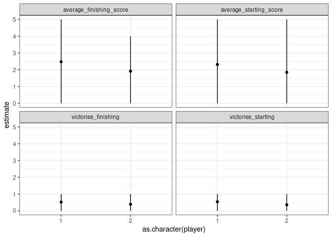

-   [Intro](#intro)
-   [Optimisation du code](#optimisation-du-code)
    -   [scenarios pour mesure de
        performance](#scenarios-pour-mesure-de-performance)
    -   [profiling](#profiling)
-   [Idées de tests pour les fonctions de
    jeu](#idées-de-tests-pour-les-fonctions-de-jeu)
-   [Idées pour l’apprentissage](#idées-pour-lapprentissage)
    -   [Apprentissage des règles](#apprentissage-des-règles)
-   [Distribution des scores](#distribution-des-scores)
-   [Performance de joueurs](#performance-de-joueurs)
    -   [Joueur aléatoire: le deuxième joueur est un peu
        avantagé](#joueur-aléatoire-le-deuxième-joueur-est-un-peu-avantagé)
    -   
-   [Si jamais on voulait optimiser encore plus la fonction Décision
    Possible Rapide
    (TakeableCardsOnBoardOptimized)](#si-jamais-on-voulait-optimiser-encore-plus-la-fonction-décision-possible-rapide-takeablecardsonboardoptimized)
-   [pour optimiser la fonction espérance de
    primiera](#pour-optimiser-la-fonction-espérance-de-primiera)
-   [espérance scopa](#espérance-scopa)
-   [faire une fonction espérance de la décision et faire un joueur
    optimisateur](#faire-une-fonction-espérance-de-la-décision-et-faire-un-joueur-optimisateur)
-   [décisions intéressantes](#décisions-intéressantes)
-   [Attention au set seed](#attention-au-set-seed)
-   [Arranger toutes les cartes](#arranger-toutes-les-cartes)
-   [Nombre de decks possibles](#nombre-de-decks-possibles)
-   [Faire une fonction
    PossibleHandOfOther()](#faire-une-fonction-possiblehandofother)
-   [Stratégies pour le joueur
    optimiseur](#stratégies-pour-le-joueur-optimiseur)

Intro
=====

Dans ce documents, des idées en vrac sur ce qu’on pourra faire

Optimisation du code
====================

scenarios pour mesure de performance
------------------------------------

On peut tester différentes approches pour l’énumération des combinaisons
sur un scénario réalise en utilisant:

    library(microbenchmark)
    microbenchmark(RunGame(seed = 1, starting_player = 1, DecisionFunction = ScopAI:::DummyDecision))

    ## Unit: milliseconds
    ##                                                                               expr
    ##  RunGame(seed = 1, starting_player = 1, DecisionFunction = ScopAI:::DummyDecision)
    ##       min       lq     mean   median       uq      max neval
    ##  3.688212 4.026866 4.670242 4.342771 4.669327 10.29162   100

Tant que deux fonctions de décision prennent les mêmes décisions elles
seront évaluées sur la même série de cartes.

profiling
---------

utiliser `profvis` pour identifier les parties du code les plus lentes.

Idées de tests pour les fonctions de jeu
========================================

Pour voir si on n’a pas introduit d’erreur, on pourrait lancer une
batterie de tests a posteriori sur une partie pour voir si elle s’est
déroulée de façon conforme.

Liste informelle de critères de validité d’une partie:  
- bonne durée: une partie doit compter 36 tours de jeu (36 cartes
déposées par un joueur)  
- le nombre total de cartes doit être conservé  
- pas de cartes dupliquées - nombres de cartes positifs dans chaque
compartiment  
- scores raisonnables

Idées pour l’apprentissage
==========================

Remarque générale: il est plus rapide et efficace de partir d’un réseau
de neurones déjà entraîné sur quelque chose.

Apprentissage des règles
------------------------

On peut vouloir apprendre les règles du jeu en apprenant des choix
licites. Pour cela, on peut soit utiliser des parties licites et
chercher à reproduire les mouvements, soit mettre une pénalité forte à
des mouvements interdits dans la fonction de score, de manière à
pénaliser ces derniers

On peut aussi choisir de contraindre les choix aux mouvements autorisés.

Distribution des scores
=======================

Il serait utile d’étudier au moins par une simulation la distribution
des scores pour différentes stratégies, afin de juger de la variabilité
et de la difficulté d’optimiser des décisions en milieu aléatoire

    Compute1Score = function(starting_player = 1, DecisionFunction = ScopAI:::RandomDecision){
      g = RunGame(starting_player = starting_player, DecisionFunction = DecisionFunction)
      tibble(starting_player = starting_player, score_player_1 = g$score_player1, score_player_2 = g$score_player2)
    }
    ComputeScores = function(seed = 1, DecisionFunction = ScopAI:::RandomDecision, ngames = 7*3, nprocs = 7){
      set.seed(seed = seed, kind = "L'Ecuyer-CMRG")
      mclapply(X = 1:ngames,
               FUN = function(x) bind_rows(Compute1Score(starting_player = 1, DecisionFunction = DecisionFunction), Compute1Score(starting_player = 2, DecisionFunction = DecisionFunction)),
               mc.set.seed = T,
               mc.preschedule = T,
               mc.cores = nprocs) %>%
      bind_rows()
        # lapply(X = 1:ngames,
        #        FUN = function(x) bind_rows(Compute1Score(starting_player = 1, DecisionFunction = DecisionFunction), Compute1Score(starting_player = 2, DecisionFunction = DecisionFunction))) %>%
        # bind_rows()
    }

    res = ComputeScores(ngames = 7*50, seed = 1) %>% 
      mutate(score_diff = score_player_1-score_player_2) %>% 
      mutate(moving_average_score_1 = cummean(score_player_1),
             moving_average_score_2 = cummean(score_player_2),
             moving_average_score_diff = cummean(score_diff))

    res %>% 
      mutate(game_idx = seq_along(score_diff)) %>% 
      gather(variable, value, moving_average_score_1:moving_average_score_diff) %>% 
      ggplot(aes(x = game_idx, y = value, colour = variable)) + 
      theme_bw() +
      geom_line() +
      ylab("Moving average score") +
      xlab("Nombre de parties") + 
      scale_colour_discrete(name ='', labels = c("Joueur 1", "Joueur 2", "Différence")) + 
      ggtitle("Stabilisation du score moyen pour des joueurs aléatoires")

On dirait qu’il faut 150-200 parties pour que les estimateurs de score
se stabilisent.

Performance de joueurs
======================

Joueur aléatoire: le deuxième joueur est un peu avantagé
--------------------------------------------------------

    res2 = ComputeScores(ngames = 7*50, seed = 1) %>% 
      mutate(score_premier_joueur = ifelse(starting_player == 1, yes = score_player_1, no = score_player_2),
             score_deuxieme_joueur = ifelse(starting_player == 2, yes = score_player_1, no = score_player_2))  %>% 
      mutate(score_diff = score_premier_joueur-score_deuxieme_joueur) %>% 
      mutate(moving_average_score_premier = cummean(score_premier_joueur),
             moving_average_score_deuxieme = cummean(score_deuxieme_joueur),
             moving_average_score_diff = cummean(score_diff))

    res2 %>% 
      mutate(game_idx = seq_along(score_diff)) %>% 
      gather(variable, value, c(moving_average_score_premier, moving_average_score_deuxieme, moving_average_score_diff)) %>% 
      ggplot(aes(x = game_idx, y = value, colour = variable)) + 
      theme_bw() +
      geom_line() +
      ylab("Moving average score") +
      xlab("Nombre de parties") + 
      scale_colour_discrete(name ='', labels = c("Deuxième joueur", "Différence", "Premier joueur")) + 
      ggtitle("Stabilisation du score moyen pour des joueurs aléatoires")

Le deuxième joueur semble avantagé !

Si jamais on voulait optimiser encore plus la fonction Décision Possible Rapide (TakeableCardsOnBoardOptimized)
===============================================================================================================

Cette fonction utilise le dictionnaire universel des (play, take) pour
réduire les possibilités et lister tous les ‘take’ associés à un play et
un board -&gt; même comme ça la recherche peut être encore longue car
plus de 1000 possibilités pour un 10 -&gt; on peut chercher un moyen de
restreindre la recherche à partir de l’info des cartes qui sont sur le
board. Par exemple on peut faire des sous-dictionnaires redondants selon
chacune des cartes présentes (donc pour takeable\_dict\[\[D6\]\] on met
des sous-entrées pour \[\[B1\]\], \[\[C1\]\], … jusqu’à \[\[S6\]\]).
-&gt; On peut aussi analyser les values du board, et faire des
sous-dictionnaires par values, comme ça on filtre tous les sous
dictionnaires n’ayant pas les bonnes values…

pour optimiser la fonction espérance de primiera
================================================

pour l’instant la fonction utilise la force brute pour regarder toutes
les combinaisons possibles de distribution des cartes entre les 2
joueurs, la seule optimisation est d’ignorer les cartes inférieures aux
2 max des joueurs car elles sont neutres pour la primiera -&gt; c’est
très long à calculer, donc on peut essayer de partitionner selon qui
prend le max de chaque couleur -&gt; si c’est 1 (1 chance sur 2), on
calcule pour le 2 sur les cartes restantes privées du max. Inversement
si c’est 2… -&gt; voir si on arrive à trouver la formule exacte en
posant le problème comme ça avec des arbres…

espérance scopa
===============

Il faut faire une espérance de la scopa qui dépend de hand1, board et
les probabilités de hand2 (dépendantes du deck restant) + décision -&gt;
cette espérance doit pousser à scoper, mais aussi à ne pas se faire
scoper (par exemple en jouant une carte qui fait atteindre un board &gt;
10 ou en laissant sur le board une somme dont on sait que l’other ne
peut pas l’avoir car elles sont toutes tombées) pour l’instant
l’espècrance scopa ne prend pas en compte la proba d’être scopée en
fonction des cartes restantes…

faire une fonction espérance de la décision et faire un joueur optimisateur
===========================================================================

espérance(décision, stack1, stack2, board, deck) prenant en compte les 4
points (cards, denari, sette bello et primiera) et les scope -&gt; on
pourrait faire un joueur qui évalue toutes les décisions possibles et
choisit celle qui optimise cette espérance (on peut éventuellement
choisir de donner des poids différents aux différentes composantes)
Certaines décisions ne font pas bouger l’espérance de (cards, denari,
sette bello et primiera), par exemple quand il n’y a pas de take
possible ou quand on take une carte déjà déterminée (par exemple un
denari quand on a déjà 21 cartes et 6 denari dont le 7). -&gt; on peut
optimiser en fonction de l’espérance de se faire scoper (soit avec le
score exact d’espérance scopa, soit en choisissant simplement le play
qui génère le plus petit board &gt; 10) ou bien on peut essayer de
minimiser l’espérance de (board + deck) pour empêcher le other de gagner
des coups au point suivant A terme on peut imaginer faire un jouer un
player qui apprend contre un other qui optimise, et faire en sorte qu’il
apprenne à gagner malgré l’optimisation du other.

décisions intéressantes
=======================

1.  on a en main un D7 et un 8, il y a sur le board un 5, 2, 1 -&gt;
    utilise-t-on le D7 pour gagner le sette bello ou le 8 pour scoper
    2-&gt; ça devrait dépendre de la probabilité qu’other ait un 1 pour
    scoper derrière, entre autres choses

2.  c’est la dernière donne, il y a un roi sur la table et on a le
    dernier roi en main. La logique est de le jouer en 3ème pour assurer
    le dernier pli, mais l’optimisation de l’espérance peut pousser à le
    jouer en premier -&gt; prendre en compte dans l’espérance le fait de
    faire le dernier pli

3.  Voir si le joueur apprend à jouer une carte &lt;=3 alors qu’il y a
    un 7 sur la table en prenant en compte la protection par une figure
    (par exemple jouer un 1 car on sait que le 7 est protégé par un 8)

Attention au set seed
=====================

Quand on fait un ShuffleNewDeck ou un InitialiseGameState avec un Seed
non NULL, est-ce que ça fige le seed uniquement au sein de la fonction
ou bien pour tout le reste ? Si c’est pour tout le reste c’est
problématique parce aque tous les sample() utilisés après seront seedés…
Regarder par exemple les fonctions RandomDecisionOptimized et
RandomDecision: on dirait que quand on réapplique plusieurs fois la
fonction avec un seed ça sort la même chose à chaque fois alors qu’il y
a plusieurs options en principe

Arranger toutes les cartes
==========================

Il me semble que si à tout moment, les cartes sont triées, ça
permettrait de diminuer le champ des possibles du jeu grâce aux
symétries (puisque l’ordre des cartes dans une main ou un stack
n’importe pas) Par exemple, ajouter dans PlayCard() et DealCard() un
sort() pour le nouveau stack(), le nouveau board(), … Et vérifier que
les éléments des dictionnaires sont bien sortés (en particulier
play\_take\_dict)

Nombre de decks possibles
=========================

Il me semble que c’est C(4, 40) x C(3, 36) x C(3, 33) x … x C(3, 3) =
C(4, 40) x 36! / (6^12) = 1.6e37… ça fait beaucoup ! Masi ça reste moins
que 40! = 8.2e47 si on ne prenait pas en compte les symétries des mains
!

Faire une fonction PossibleHandOfOther()
========================================

-   en input, game\_state et player
-   en output, toutes les mains possibles pour l’adversaire en prenant
    en compte le nombre de cartes qu’il a en main et les cartes
    “inconnues” qui sont le deck + la hand de l’adversaire (noté
    possible\_deck) -&gt; cela dépend s’il a 1, 2 ou 3 cartes en main
    -&gt; disons qu’il a x cartes en mains -&gt; il faut retourner
    combn(possible\_deck, m = x) -&gt; il y a x parmi
    length(possible\_deck) possibilités, soit au maximum 3 parmi 33 =
    5456 possibilités de hand

Stratégies pour le joueur optimiseur
====================================

On peut imaginer diverses stratégies : 1) le joueur optimise l’espérance
de la nième décision, et en cas d’égalité entre différentes décisions il
utilise une fonction déterministe pour trancher. Par exemple, laisser le
plus petit board possible supérieur à 10. Et/ou ne pas poser de Denari,
ou ne pas poser de 7. 2) le joueur optimise espérance(nième décision) -
espérance(n+1ème décision pour other) 3) le joueur optimise esp(n) -
esp(n+1) + esp(n+2) - esp(n+3) + …

Notons possible\_deck = union(deck,
other*h**a**n**d*)*P**o**u**r**l**a**s**t**r**a**t**é**g**i**e**n**u**m**é**r**o*2, *p**l**u**s**i**e**u**r**s**p**o**s**s**i**b**i**l**i**t**é**s**p**o**u**r**o**p**t**i**m**i**s**e**r**l*′*e**s**p**é**r**a**n**c**e**d**u**p**l**a**y**e**r*, *s**a**c**h**a**n**t**q**u*′*o**n**n**e**c**o**n**n**a**i**t**p**a**s**s**e**s**c**a**r**t**e**s* : *a*)*m**é**t**h**o**d**e**d**u**v**r**a**i**c**a**l**c**u**l* : *f**a**i**r**e**l**a**m**o**y**e**n**n**e**d**e**s**s**c**o**r**e**s**d**e**l*′*a**d**v**e**r**s**a**i**r**e**e**n**f**o**n**c**t**i**o**n**d**e**t**o**u**t**e**s**l**e**s**c**o**m**b**i**n**a**i**s**o**n**s**d**e**c**a**r**t**e**s**q**u*′*i**l**p**o**u**r**r**a**i**t**a**v**o**i**r*(*a**v**e**c**l**a**f**o**n**c**t**i**o**n**P**o**s**s**i**b**l**e**H**a**n**d**O**f**O**t**h**e**r*) −  &gt; *p**o**u**r**c**h**a**c**u**n**e**d**e**c**e**s**h**a**n**d**s*, *c**o**n**s**i**d**é**r**e**r**q**u**e**l*′*a**d**v**e**r**s**a**i**r**e**o**p**t**i**m**i**s**e**à*1*c**o**u**p*, *e**t**c**h**o**i**s**i**r**l*′*e**s**p**é**r**a**n**c**e**d**a**n**s**c**e**c**a**s*, *e**t**f**a**i**r**e**l**a**m**o**y**e**n**n**e**d**e**s**e**s**p**é**r**a**n**c**e**s*. −  &gt; *c*′*e**s**t**p**l**u**s**l**o**n**g**à**c**a**l**c**u**l**e**r**q**u**a**n**d**l*′*a**d**v**e**r**s**a**i**r**e**a*3*c**a**r**t**e**s**e**n**m**a**i**n**s*, *e**t**c*′*e**s**t**p**l**u**s**r**a**p**i**d**e**à**c**a**l**c**u**l**e**r**q**u**a**n**d**l**e**j**e**u**a**v**a**n**c**e*(*m**a**x**i**m**u**m*5456*c**o**m**b**i**n**a**i**s**o**n**a**u**p**r**e**m**i**e**r**c**a**l**c**u**l*) −  &gt; *q**u**a**n**d**l*′*a**d**v**e**r**s**a**i**r**e**a**u**n**e**s**e**u**l**e**c**a**r**t**e**e**n**m**a**i**n*, *c**e**t**t**e**m**é**t**h**o**d**e**e**s**t**a**u**s**s**i**r**a**p**i**d**e**q**u**e**l**e**s**a**u**t**r**e**s**d**o**n**c**a**u**t**a**n**t**l*′*u**t**i**l**i**s**e**r*; *q**u**a**n**d**i**l**a*2*c**a**r**t**e**s**e**n**m**a**i**n**s*, *i**l**y**a**a**u**m**a**x*2*p**a**r**m**i*33 = 528*c**o**m**b**i**n**a**i**s**o**n**s**b*)*m**é**t**h**o**d**e**q**u**i**e**n**v**i**s**a**g**e**l**e**p**i**r**e* : *o**p**t**i**m**i**s**e**r**l*′*e**s**p**é**r**a**n**c**e**d**u**j**o**u**e**u**r**c**o**m**m**e**s*′*i**l**a**v**a**i**t**e**n**m**a**i**n**t**o**u**t**l**e**p**o**s**s**i**b**l**e**d**e**c**k* −  &gt; *c*’*e**s**t* − *à* − *d**i**r**e**o**p**t**i**m**i**s**e**r**l**e**s**e**x**p**e**c**t**e**d**s**c**o**r**e**s**d**e**t**o**u**t**e**s**l**e**s**d**é**c**i**s**i**o**n**s**p**o**s**s**i**b**l**e**s**s**i**l**e**g**a**m**e**s**t**a**t**e*other$hand
était égal au possible\_deck -&gt; autrement dit, on considère le pire
scénario possible, le cas où l’adversaire aurait la meilleure carte à
jouer possible -&gt; il y a length(possible\_deck) calculs à faire, donc
maximum 33 c) méthode de l’adversaire au hasard : faire la moyenne des
scores de l’adversaire en fonction des length(possible\_deck) cartes
restantes, équiprobablement -&gt; ça permet de limiter le nombre de
calcul (max 33 au premier tour) mais ce n’est pas très réaliste car
l’adversaire qui a 3 cartes en mains ne va pas les jouer au hasard. Ce
n’est pas non plus une random décision parce que le play est laissé au
hasard mais le take est optimisé. d) compromis entre les méthodes b) et
c) : entre le scénario du pire et le scénario ou l’adversaire joue ses
cartes au hasard, on peut mettre des probas tout en limitant le nombre
de calculs à 33 au max : -&gt; exemple, dans le cas où l’adversaire a 3
cartes en main : - on classe tous les scores possibles avec toutes les
cartes du possible\_deck, - on fait une moyenne pondérée en mettant un
poids 3 au tiers numéro 1, poids 2 au tiers numéro 2, poids 1 au tiers
numéro 3 -&gt; on se dit que l’adversaire a une plus grande probabilité
de jouer des bonnes cartes que des mauvaises car dans sa main à 3 cartes
il a des chances d’en avoir une au moins bonne -&gt; si par contre le
joueur a 2 cartes en main, on peut diviser en tiers 1 / tiers 2 avec
poids 1.5 et 1 (par exemple) -&gt; si il a une carte en main on fait le
choix équiprobable puisqu’il est vrai e) méthode du joueur omniscient :
c’est de la triche, mais si on veut créer un joueur très dur à battre
contre qui apprendre, on peut le faire jouer en sachant les cartes de
l’adversaire -&gt; il optimise espérance(n) - espérance(n+1) avec les
vraies infos de la hand de l’adversaire pour n+1 -&gt; le calcul est
beaucoup plus rapide, et il permet d’implémenter rapidement la stratégie
numéro 3 qui calcule toutes les probas jusqu’au bout (et peut prendre en
compte le last take). -&gt; on peut même le faire un peut récursivement
pour calculer les espérances de n, n+1, n+2… en considérant que other
est aussi un omniscient qui calcule à plusieurs coups…
